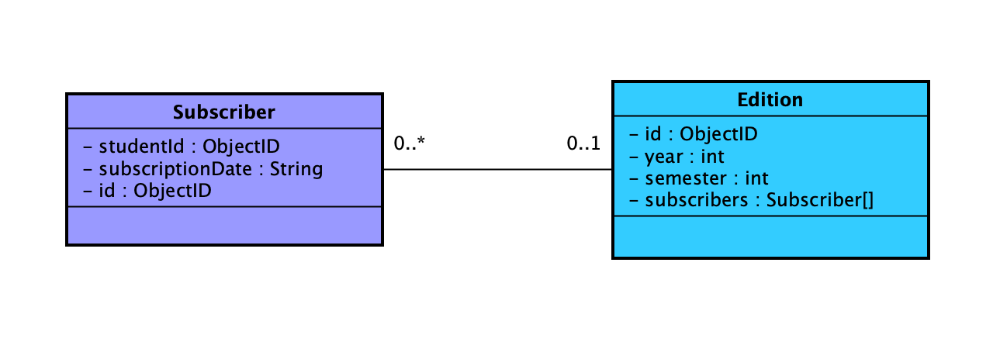

# constr-sw-P2

## Subindo o ambiente de dev

1. Entre na pasta **app**
2. Crie um arquivo **.env** e defina as seguintes variáveis: 

```
# General
PORT=<PORTA>

# Keycloak
BASE_URL=http://3.15.140.59:8080/auth
REALM_NAME=master

# Database
DB_DEV_HOST=localhost:27018
DB_NAME=database
```

* Caso seja necessário, altere os valores das variáveis para o seu ambiente.

3. Rode o comando ```npm i``` para instalar as dependências
4. Suba uma instância local do MongoDB com o comando ```docker-compose up```
    * Configura se a instância está rodando com o comando ```docker-compose ps```   
5. Inicialize o servidor com o comando ```npm start```

## URL em prod
Para acessar a API em produção, utilize o endereço: ```ec2-3-16-76-105.us-east-2.compute.amazonaws.com```. Para realizar requisições, o usuário deve se autenticar através de Bearer Token.

Para testar os endpoints, pode-se utilizar o Postman ou [ReqBin](https://reqbin.com/) (ferramenta online)

## Swagger Hub
A documentação dos endpoints disponíveis pode ser acessada por [aqui](https://app.swaggerhub.com/apis/munaretto/construcao_p2/1.0.0)

## Gerando documentação

Na pasta **app**, rode o comando ```npm run start-gendoc``` para criar outputFile para swagger.

## Modelos de dados

Esta API contém os dados das entidades ```Edition``` e ```Subscriber```.
Suas propriedades e relações podem ser observadas na imagem abaixo:


